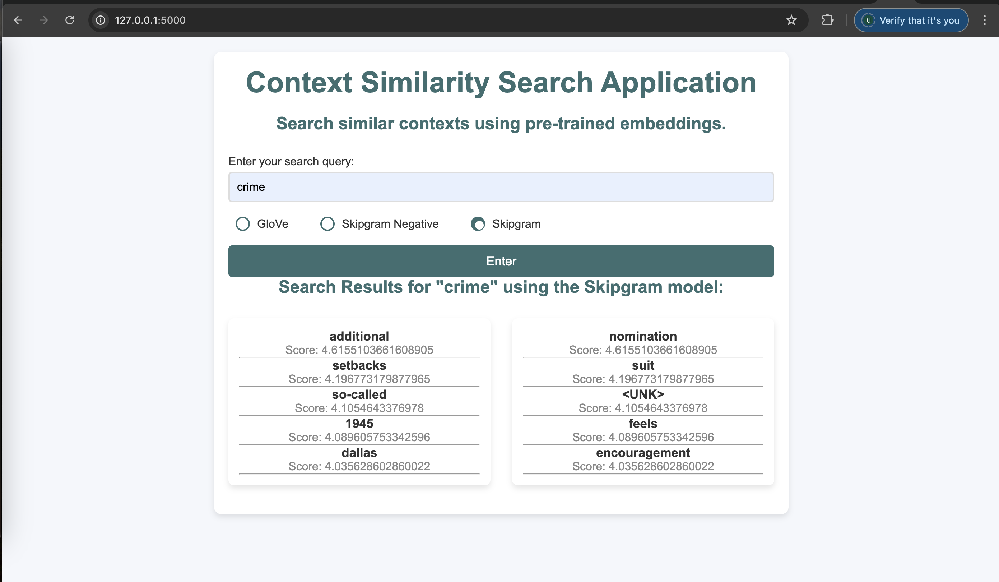

# Context Similarity Search Application

This web application allows users to search for the most similar contexts to their input query using pre-trained word embeddings models such as **GloVe**, **Skipgram Negative**, and **Skipgram**. The application computes the similarity between the query and a pre-trained corpus, providing the top 10 most relevant contexts.

### Features
- Search query input box.
- Choose from pre-trained models: **GloVe**, **Skipgram Negative**, or **Skipgram**.
- Displays the top 10 similar contexts for the input query.
- Results are split into two columns for better readability.

### Models Used
1. **GloVe**: Pre-trained GloVe embeddings.
2. **Skipgram Negative**: Skipgram model with negative sampling.
3. **Skipgram**: Skipgram model without negative sampling.

### Tech Stack
- **Frontend**: HTML, CSS (Custom styling for radio buttons and layout)
- **Backend**: Flask (Python)
- **Pre-trained Models**: 
    - GloVe embeddings
    - Skipgram (Word2Vec)
    - Skipgram Negative (Word2Vec with negative sampling)

### Installation

1. Clone the repository:

```bash
git clone https://github.com/usmankhalid-95/A1---Word2Vec-and-GloVe.git
```

### How It Works
1. The user enters a query in the search box and selects a pre-trained model (GloVe, Skipgram Negative, or Skipgram).
2. The app then computes the dot product between the query and the pre-trained corpus to determine the top 10 most similar contexts.
3. The results are displayed in two columns, with each result showing the context and its similarity score.

---

## Tasks Completed

1. **Model Training**: 
   - Modified the Word2Vec and GloVe models (including Skipgram and Skipgram with negative sampling) as per the lab lecture.
   - Trained models using real-world news data sourced from the NLTK dataset.

2. **Model Comparison**:
   - Compared models based on training loss, training time, and accuracy in syntactic and semantic tasks.
   - Evaluated models using a word analogies dataset (capital-common-countries for semantic and past-tense for syntactic tasks).
   
3. **Correlation Analysis**:
   - Performed correlation analysis using the similarity dataset to assess the correlation between the models' dot product and human judgment.

4. **Web Application**:
   - Developed a simple web application with an input box for search queries to search for similar contexts.

---

## Model Comparison and Performance

| **Model**                        | **Window Size** | **Training Loss** | **Training Time** | **Syntactic Accuracy** | **Semantic Accuracy** |
|-----------------------------------|:---------------:|:-----------------:|:----------------:|:----------------------:|:---------------------:|
| **Skipgram**                      |        2        |      7.804078     |       0.838465       |           0            |           0           |
| **Skipgram negative sampling** |        2        |      0.252254     |       0.915590       |           0            |           0           |
| **GloVe**                         |        2        |      1.761795     |       0.163522       |           0            |           0           |
| **GloVe Gensim** |       NA        |         NA        |         NA         |         0.50           |         0.93          |

---

## Correlation Results

| **Model**            | **Skipgram** | **Skipgram negative** | **GloVe** | **GloVe gensim** |
|----------------------|--------------|-----------------------|-----------|------------------|
| **Correlation**       |    0.064204  |     -0.05998          |   0.05199 |      0.54308     |

---

### Screenshots
- 
- 
- 

